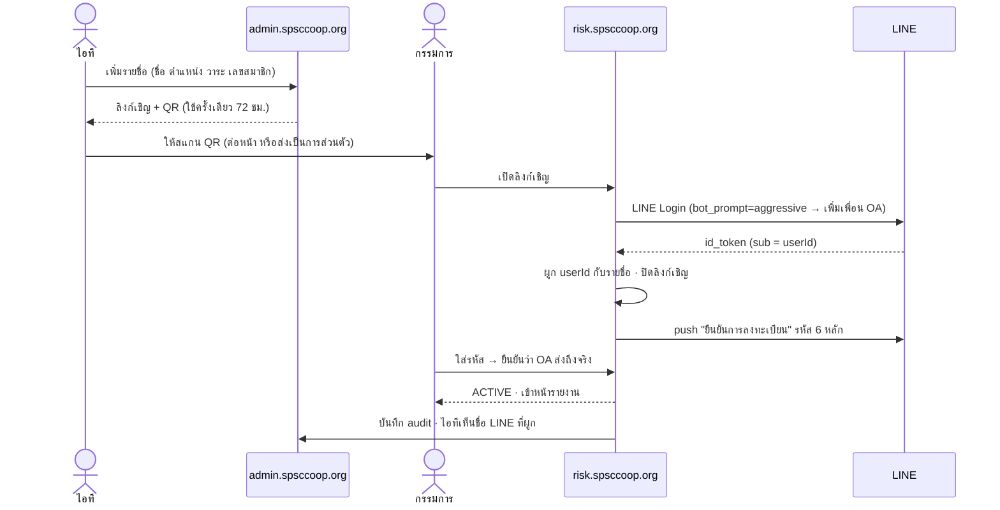

# ระบบรายงานเฝ้าระวังความเสี่ยง — แบบร่างก่อนลงมือ

> ## ⛔ ยกเลิกโครงการแล้ว — 17 ก.ย. 2569
>
> เจ้าของเว็บสั่งล้มโครงการนี้ **ไม่ต้องทำต่อ และอย่าเสนอขึ้นมาใหม่**
> เก็บไฟล์นี้ไว้เป็นประวัติเฉย ๆ เผื่อวันหน้ากลับมาคิดใหม่จะได้มีของเดิมให้อ่าน
> ไม่ต้องเริ่มคิดจากศูนย์
>
> **ไม่เคยมีโค้ดของระบบนี้ในโปรเจกต์เลยสักบรรทัด** (ตรวจแล้ว 17 ก.ย. 2569)
> จึงไม่มีอะไรต้องรื้อถอน

สถานะเดิมตอนร่าง: **แบบร่างให้พิจารณา ยังไม่ได้เขียนโค้ด** (15 ก.ย. 2569)

ความเสี่ยง 5 ด้าน: การเงิน · บัญชี · สินเชื่อ · บริหาร · เทคโนโลยีและสารสนเทศ
ผู้อ่าน: คณะกรรมการดำเนินการ (ไอทีเป็นคนกำหนดว่าใครเข้าได้) · เข้าด้วย LINE ไม่ต้องจำรหัสผ่าน

---

## 0. สิ่งที่พบในระบบตอนนี้ — กำหนดทิศทางของแบบนี้

### 0.1 ⚠️ รายงานลับส่งผ่านตัวมิเรอร์ของ www.spsccoop.com ตรง ๆ ไม่ได้

`php-frontend/index.php` เก็บสำเนา **ทุกคำขอ GET ตามที่อยู่อย่างเดียว** และไม่ส่งคุกกี้ต่อให้หลังบ้าน

- ส่งคุกกี้ไม่ถึง → หลังบ้านไม่รู้ว่าใครเปิด → ล็อกอินไม่ได้เลย
- ถ้าไปแก้ให้ส่งคุกกี้ → หน้ารายงานที่กรรมการคนแรกเปิด **จะถูกเก็บลงแคชบนโฮสต์
  แล้วเสิร์ฟให้ใครก็ได้ที่เปิดที่อยู่เดียวกัน** ภายใน 120 วินาทีถัดมา
- แก้ `php-frontend/` = ต้อง FTP ขึ้นโฮสต์ ซึ่งเคยเผาไอพีสำนักงานมาแล้ว 3 เส้น

**ข้อเสนอ:** ตัวระบบรายงานอยู่ที่ซับโดเมนของ `.org` เช่น **`risk.spsccoop.org`**
ผ่าน Cloudflare Tunnel ตัวเดิม (แบบเดียวกับ `admin.spsccoop.org`) ส่วน `www.spsccoop.com`
มี **เมนู/ปุ่ม "รายงานความเสี่ยง (สำหรับกรรมการ)"** ชี้ไปที่นั่น

```
กรรมการ → www.spsccoop.com (เห็นเมนู) ──ลิงก์──→ risk.spsccoop.org  (ล็อกอิน · อ่านรายงาน)
                                                   │
                                          Cloudflare Tunnel → web:3000 (เครื่องนี้)
```

ผลที่ได้:

| เรื่อง | ผล |
|---|---|
| แตะโฮสต์ไหม | **ไม่แตะเลย** — เมนูบน `.com` มาจากหลังบ้าน โฮสต์ดึงไปเองตามปกติ |
| รายงานรั่วผ่านแคช | เป็นไปไม่ได้ — ไม่มีคำขอใดของ `risk.` วิ่งผ่านโฮสต์ |
| ตัวมิเรอร์ขอ `spsccoop.org/risk/…` | `src/proxy.ts` ตอบ 404 เพราะไม่ใช่โดเมน `risk.` (ไม่ต้องแก้ PHP) |
| โฮสต์ล่ม / ไอพีโดนแบน | กรรมการยังเข้าได้ปกติ คนละเส้นทาง |
| เครื่องนี้ปิด (กลางคืน · เสาร์อาทิตย์) | **เข้าไม่ได้** — ต้องยอมรับ หรือย้ายไปเครื่องที่เปิดตลอด (ดูข้อ 7) |

### 0.2 LINE Login มีอยู่แล้ว — ใช้โค้ดเดิมต่อได้เกือบทั้งหมด

`src/lib/line.ts` ทำครบแล้ว: `state` กัน CSRF · `nonce` · ตรวจ `id_token` ผ่านปลายทาง verify
ของ LINE · ไม่เดาโดเมนจากหัว `Host` · `lineFlow.ts` เก็บสถานะรอบในคุกกี้ 10 นาที

แต่ตอนนี้ผูกกับตาราง `User` (เจ้าหน้าที่หลังบ้าน) — **กรรมการต้องเป็นตารางแยก** (ข้อ 2)

---

## 1. แบ่งเฟส

| เฟส | งาน | ขึ้นกับ |
|---|---|---|
| **1** | **ผู้เข้าถึงรายงาน + Login Service** (เอกสารนี้ลงรายละเอียดเฟสนี้) | LINE OA + Login channel |
| 2 | โครงข้อมูลความเสี่ยง — 5 ด้าน · ตัวชี้วัด (KRI) · เกณฑ์เขียว/เหลือง/แดง · งวดรายงาน · กรอกมือได้ก่อน | เฟส 1 |
| 3 | นำเข้า Excel — แม่แบบคอลัมน์ · ดูตัวอย่างก่อนนำเข้า · บันทึกว่ามาจากไฟล์ไหน | เฟส 2 |
| 4 | อ่าน PDF — PDF ที่มีตัวอักษรใช้ `pdftotext` · PDF สแกนใช้ AI (OpenRouter ตัวเดิม) · **เจ้าหน้าที่ยืนยันก่อนบันทึกเสมอ** | เฟส 2 |
| 5 | ดึงผ่าน ODBC จากระบบอื่น — service แยก ใช้บัญชีอ่านอย่างเดียว ดึงตามรอบ | เฟส 2 · ต้องรู้ชนิดฐานปลายทาง |
| 6 | หน้ารายงาน — แดชบอร์ด · แนวโน้ม · แผนผังความเสี่ยง 5×5 · ส่งออก PDF เข้าวาระประชุม · กรรมการกด "รับทราบ" | เฟส 2–5 |
| 7 | แจ้งเตือนผ่าน LINE เมื่อมีรายงานใหม่หรือตัวชี้วัดเข้าโซนแดง (ส่งแค่ "มีรายงานใหม่" ไม่ส่งตัวเลข) | เฟส 1 + 6 |

หลักของเฟส 3–5 ใช้แบบเดียวกับวันหยุด/ปฏิทินที่มีอยู่แล้ว: **ดูรายการก่อน → ติ๊กเลือก → ค่อยเข้าฐาน**
และทุกค่าที่เก็บต้องบอกได้ว่ามาจากไหน (`manual` · `excel` · `pdf` · `odbc`) ครั้งไหน ใครกด

---

## 2. เฟส 1 — ใครคือผู้ใช้

### 2.1 แยก "กรรมการ" ออกจาก "เจ้าหน้าที่หลังบ้าน"

| | เจ้าหน้าที่ (`User`) | ผู้อ่านรายงาน (`RiskViewer`) |
|---|---|---|
| เข้าที่ | `admin.spsccoop.org` | `risk.spsccoop.org` |
| ทำอะไรได้ | แก้เว็บ · นำเข้าข้อมูลความเสี่ยง | **อ่านอย่างเดียว** + กดรับทราบ |
| อายุบัญชี | ตามการจ้างงาน | **ตามวาระ** (ชุดที่ 45 หมดวาระ = หมดสิทธิ์เอง) |
| คุกกี้ | `spsc_session` | `spsc_risk` แยกตัว ใช้ข้ามกันไม่ได้ |

เหตุผลที่ไม่ใช้ตาราง `User` ร่วม: ถ้ากรรมการเป็นแถวใน `User` วันไหนมีคนตั้ง `areas` ผิด
หรือลืมเช็คสิทธิ์ใน route ใหม่สักตัว กรรมการจะแก้เว็บได้ · แยกตารางแล้ว **ด่านของกันและกัน
ข้ามกันไม่ได้ตั้งแต่โครงสร้าง** ไม่ต้องพึ่งว่าทุกคนจำเช็คสิทธิ์ครบ

คนที่เป็นทั้งเจ้าหน้าที่และต้องอ่านรายงาน (เช่น ผู้จัดการ) มีสองแถวได้ ผูก LINE เดียวกันได้
เพราะ unique แยกตาราง

### 2.2 ไอทีจัดการในหลังบ้าน

เมนูใหม่ **หลังบ้าน → รายงานความเสี่ยง → ผู้เข้าถึงรายงาน** · สิทธิ์ `risk.viewers`
(เพิ่มใน `src/lib/permissions.ts` · ADMIN เข้าได้เสมอตามกฎเดิม)

ข้อมูลที่ไอทีกรอก: ชื่อ-สกุล · ตำแหน่ง · กลุ่ม (กรรมการดำเนินการ / ผู้ตรวจสอบกิจการ /
ฝ่ายจัดการ) · ชุดที่ · **วันหมดวาระ** · เลขสมาชิก · เบอร์โทร · ด้านที่อ่านได้ (ว่าง = ทั้ง 5 ด้าน)

ปุ่มที่ต้องมี: ออกลิงก์เชิญ (QR) · ระงับทันที · ปลดการผูก LINE · ออกจากระบบทุกเครื่อง ·
ดูประวัติเข้าใช้

### 2.3 โครงตาราง (ร่าง)

```prisma
enum RiskViewerStatus { INVITED ACTIVE SUSPENDED }

model RiskViewer {
  id           String   @id @default(cuid())
  name         String
  position     String?
  group        String            // board | auditor | management
  termNo       Int?              // ชุดที่
  termEndsAt   DateTime?         // พ้นวันนี้ = เข้าไม่ได้เอง ไม่ต้องรอใครมาปิด
  memberNo     String?  @unique  // ใช้ขอ OTP บนคอมพิวเตอร์
  phone        String?
  lineUserId   String?  @unique
  lineName     String?           // ชื่อที่โชว์ใน LINE ตอนผูก — ให้ไอทีเทียบว่าผูกถูกคน
  lineLinkedAt DateTime?
  riskAreas    String[] @default([])   // finance accounting credit management it · ว่าง = ทุกด้าน
  status       RiskViewerStatus @default(INVITED)
  createdById  String            // ไอทีคนไหนเพิ่ม
  lastLoginAt  DateTime?
  createdAt    DateTime @default(now())
  updatedAt    DateTime @updatedAt
}

model RiskInvite {          // ลิงก์เชิญใช้ครั้งเดียว
  id        String   @id @default(cuid())
  viewerId  String
  tokenHash String   @unique   // เก็บแฮช ของจริงอยู่ใน QR เท่านั้น
  expiresAt DateTime            // 72 ชม.
  usedAt    DateTime?
}

model RiskOtp {
  id         String   @id @default(cuid())
  viewerId   String
  flowHash   String             // ผูกกับคุกกี้ของเบราว์เซอร์ที่ขอ — เอารหัสไปใส่เครื่องอื่นไม่ได้
  codeHash   String             // HMAC(รหัส 6 หลัก) ไม่เก็บตัวเลขจริง
  expiresAt  DateTime           // 5 นาที
  attempts   Int      @default(0)
  consumedAt DateTime?
  createdAt  DateTime @default(now())
  @@index([viewerId, createdAt])
}

model RiskSession {
  id         String   @id          // แฮชของโทเคนในคุกกี้ — ฐานหลุดก็เอาไปสวมไม่ได้
  viewerId   String
  method     String                // line | otp | emergency
  ip         String?
  userAgent  String?
  createdAt  DateTime @default(now())
  lastSeenAt DateTime @default(now())
  expiresAt  DateTime
  revokedAt  DateTime?
  @@index([viewerId])
}

model RiskAudit {            // ทุกการเข้าใช้และทุกการเปิดรายงาน
  id        String   @id @default(cuid())
  viewerId  String?
  actorId   String?          // เจ้าหน้าที่ที่ทำรายการในหลังบ้าน
  action    String           // invite.create · line.link · otp.send · otp.fail · login · report.view · report.export …
  detail    Json?
  ip        String?
  createdAt DateTime @default(now())
  @@index([viewerId, createdAt])
}
```

---

## 3. Login Service

### 3.1 ต้องมีช่อง LINE สองชนิด — และต้องอยู่ Provider เดียวกัน

| ช่อง | ใช้ทำอะไร | มีแล้วหรือยัง |
|---|---|---|
| **LINE Login channel** | รู้ว่าคนที่กดคือ LINE บัญชีไหน (`sub` = userId) | มีแล้ว (ใช้กับหลังบ้าน) — เพิ่ม Callback URL ของ `risk.` ได้ในช่องเดิม |
| **Messaging API channel** (LINE OA) | **ส่ง OTP เข้าแชต** ด้วย push message | ต้องตัดสินใจ — ใช้ OA เดิมของสหกรณ์ หรือเปิดใหม่ |

⚠️ **userId ของ LINE เป็นค่าต่อ Provider ไม่ใช่ค่าต่อคน** — ถ้าช่อง Login กับ OA อยู่คนละ
Provider ใน LINE Developers จะได้ userId คนละเลขสำหรับคนเดียวกัน แล้ว **ส่ง OTP ไม่ถึงเลย**
ต้องเช็คเรื่องนี้ก่อนเริ่มเขียนโค้ด

⚠️ **ส่ง push ได้เฉพาะคนที่เพิ่ม OA เป็นเพื่อนแล้ว** — ตั้ง "Linked LINE Official Account"
ในช่อง Login แล้วส่ง `bot_prompt=aggressive` ตอนผูกบัญชี LINE จะถามให้เพิ่มเพื่อนในหน้าเดียวกัน
· ตรวจว่าเป็นเพื่อนอยู่ไหมได้จาก `GET /v2/bot/profile/{userId}` (ไม่เป็นเพื่อน = 404)

⚠️ **push message นับโควตาข้อความของ OA** ต้องเช็คแพ็กเกจ · ประมาณการ: กรรมการ 20 คน ×
ขอ OTP 8 ครั้ง/เดือน ≈ 160 ข้อความ · ถ้าใช้ OA เดิมที่ส่งประกาศถึงสมาชิกอยู่แล้ว โควตาอาจไม่พอ

### 3.2 ลงทะเบียน (ทำครั้งเดียว)



- **ไม่มีการสมัครเอง** — LINE ที่ไม่ได้มาจากลิงก์เชิญ กดเข้ามากี่ครั้งก็ถูกปฏิเสธ (หลักเดียวกับหลังบ้าน)
- ลิงก์เชิญเป็นความลับระดับรหัสผ่าน — ใครได้ลิงก์ไปก่อนก็ผูก LINE ตัวเองได้ · กันด้วยอายุสั้น ·
  ใช้ครั้งเดียว · **ไอทีเห็นชื่อ LINE ที่ผูกทันที** ถ้าไม่ใช่ชื่อเจ้าตัวกดปลดได้เลย
- ส่ง OTP ยืนยันตอนท้ายไม่ใช่พิธี — มันพิสูจน์ว่า OA ส่งหาคนนี้ได้จริง ไม่งั้นจะมารู้ตอนเขาเข้าใช้ครั้งแรกแล้วติด

### 3.3 เข้าใช้ — สองทาง

**ทาง A: บนมือถือ (ทางหลัก) — กดปุ่มเดียว**

```
เปิด risk.spsccoop.org → "เข้าด้วย LINE" → LINE ยืนยันตัวตน → เข้าเลย
```

เปิดในแอป LINE (ผ่าน LIFF หรือริชเมนูของ OA) แทบไม่ต้องกดอะไร

**ทาง B: บนคอมพิวเตอร์ / จอห้องประชุม — OTP ผ่าน LINE**

```
ใส่เลขสมาชิก → OTP 6 หลักเด้งเข้า LINE บนมือถือ → พิมพ์ลงคอม → เข้า
```

ทางนี้คือเหตุผลที่ OTP มีประโยชน์จริง: เครื่องในห้องประชุมไม่มี LINE ล็อกอินอยู่
และไม่ควรล็อกอินค้างไว้ · สิ่งที่พิสูจน์ตัวตนคือ "มือถือที่มี LINE ของเจ้าตัว"

> ⚠️ ถ้าเข้าด้วยทาง A แล้ว **ไม่ควรขอ OTP ซ้ำอีกชั้น** — LINE Login กับ OTP ทางแชต LINE
> พิสูจน์สิ่งเดียวกัน (มือถือเครื่องเดียวกัน) ถามซ้ำได้ความรำคาญ ไม่ได้ความปลอดภัยเพิ่ม
> ถ้าต้องการชั้นที่สองจริง ต้องเป็นของคนละอย่าง (เช่น PIN ที่เจ้าตัวตั้งเอง) — ให้เป็นทางเลือกในเฟสหลัง

### 3.4 กฎของ OTP

| กฎ | ค่า | กันอะไร |
|---|---|---|
| ความยาว | 6 หลัก สุ่มด้วย `crypto.randomInt` | เดา (ล้านแบบ) |
| อายุ | 5 นาที · ใช้ครั้งเดียว | เอารหัสเก่ามาใช้ |
| ผิดได้ | 5 ครั้งต่อรหัส แล้วรหัสนั้นตาย | ยิงเดา |
| ขอใหม่ | เว้น 60 วินาที · ไม่เกิน 5 ครั้ง/ชม. ต่อคน | **ยิงให้โควตา OA หมด** · ก่อกวนเจ้าตัว |
| นับด่าน | **ตามเลขสมาชิก** และตามไอพี | ไอพีปลอมหัวได้ (บทเรียนจาก `/api/auth/login` 20 ส.ค. 2026) |
| ผูกเบราว์เซอร์ | รหัสใช้ได้เฉพาะเบราว์เซอร์ที่กดขอ (`flowHash` ในคุกกี้) | คนแอบดูรหัสจากจอมือถือแล้วไปใส่เครื่องตัวเอง |
| เก็บ | HMAC ด้วยกุญแจใน `.env` ไม่เก็บตัวเลขจริง | ฐานหลุด |
| ตอบกลับ | **ข้อความเดียวกันทุกกรณี** "ถ้าข้อมูลถูกต้อง รหัสจะส่งไปที่ LINE ของท่าน" | ไล่เดาว่าเลขสมาชิกไหนเป็นกรรมการ |

ข้อความใน LINE: รหัส · เวลาหมดอายุ · "ขอจากเบราว์เซอร์ Chrome บน Windows เวลา 14:05 น." ·
"ถ้าท่านไม่ได้ขอ ไม่ต้องทำอะไร และห้ามบอกรหัสนี้กับใคร รวมถึงเจ้าหน้าที่สหกรณ์"

⚠️ **ห้ามส่งข้อความภาษาไทยผ่าน header** — ข้อความ OTP อยู่ใน body JSON เท่านั้น (บทเรียน `X-Title` ใน AGENTS.md)

### 3.5 Session

- โทเคนสุ่ม 32 ไบต์ในคุกกี้ `spsc_risk` · `httpOnly` · `Secure` · `SameSite=Lax` · ผูกโดเมน `risk.` เท่านั้น
- ในฐานเก็บ **แฮช** ของโทเคน
- ไม่ขยับ 30 นาทีหลุด · นานสุด 8 ชม. ต่อครั้ง (ครอบประชุมทั้งวัน)
- **ทุกคำขอเช็คสด ๆ**: `status = ACTIVE` · `termEndsAt` ยังไม่ถึง · session ไม่ถูก revoke
  → ไอทีกดระงับแล้วหลุดทันทีในคำขอถัดไป ไม่ต้องรอหมดอายุ
- ปุ่ม "ออกจากระบบทุกเครื่อง" ทั้งฝั่งเจ้าตัวและฝั่งไอที

### 3.6 ด่านโดเมน (`src/proxy.ts`)

เพิ่ม `RISK_HOST` ใน `.env` แล้วกันสองทิศ

| คำขอ | โดเมน `risk.` | โดเมนอื่น |
|---|---|---|
| `/risk/*` · `/api/risk/*` | ผ่าน | **404** |
| `/admin/*` · `/login` · หน้าเว็บสาธารณะ | **404** | ตามเดิม |

localhost เปิดไว้เสมอเหมือนกฎเดิม — ใช้ทดสอบบนเครื่องนี้

### 3.7 ทางออกฉุกเฉินเมื่อ LINE ใช้ไม่ได้

หลังบ้านเปิด localhost ไว้เสมอ แต่กรรมการไม่ได้นั่งที่เครื่องนี้ จึงต้องมีทางเฉพาะ:
ไอทีกด **"ออกลิงก์เข้าใช้ครั้งเดียว"** ให้กรรมการคนนั้น (อายุ 15 นาที · ใช้ครั้งเดียว ·
session สั้น 2 ชม. · ขึ้นแถบสีเตือนตลอด · บันทึก audit ว่าไอทีคนไหนออกให้)
**ปิดความสามารถนี้ได้ใน Setting** ถ้าไม่ต้องการ

### 3.8 ไฟล์ที่จะเกิดขึ้นในเฟส 1 (ร่าง)

```
prisma/migrations/…_risk_viewers/
src/lib/riskAuth.ts            session · เช็คสิทธิ์ · requireViewer()
src/lib/riskOtp.ts             ออก/ตรวจ OTP · ด่านนับครั้ง
src/lib/lineMessaging.ts       push message · เช็คสถานะเพื่อน (ไม่แตะ line.ts เดิม)
src/lib/line.ts                แก้ให้รับ callbackUrl ได้หลายชุด (admin / risk)
src/proxy.ts                   เพิ่มด่าน RISK_HOST
src/app/api/risk/auth/line/{start,callback}/
src/app/api/risk/auth/otp/{request,verify}/
src/app/api/risk/auth/logout/
src/app/api/risk/invite/[token]/
src/app/risk/(login · register · หน้าแรกรายงานว่าง ๆ)
src/app/admin/risk/viewers/     ไอทีจัดการรายชื่อ
src/app/api/admin/risk/viewers/ requireWrite("risk.viewers")
```

`.env` ที่ต้องเพิ่ม (เจ้าของเว็บเป็นคนใส่เอง):
`RISK_HOST` · `LINE_MESSAGING_CHANNEL_ACCESS_TOKEN` · `RISK_OTP_SECRET` · `LINE_RISK_CALLBACK_URL`

ฝั่ง Cloudflare: เพิ่ม Public Hostname `risk.spsccoop.org` → `http://web:3000` ในอุโมงค์เดิม

---

## 4. ประเด็นความปลอดภัยที่ต้องรับรู้

1. **รายงานความเสี่ยงเป็นข้อมูลอ่อนไหวของสหกรณ์** — บันทึกทุกการเปิดรายงาน/ส่งออก ·
   เฟส 6 ใส่ลายน้ำชื่อผู้เปิด + เวลา ทั้งบนจอและใน PDF
2. ข้อความแจ้งเตือนทาง LINE (เฟส 7) **ห้ามมีตัวเลข** — แชต LINE ถูกแคปจอส่งต่อได้ง่าย
3. PDPA: เก็บเฉพาะที่ใช้ · audit เก็บ 2 ปีแล้วลบ (ต้องยืนยันนโยบาย)
4. เส้นทาง `/api/risk/*` ไม่อยู่ใต้ `/api/admin` → ต้องมี `requireViewer()` ทุก route ·
   เพิ่มตัวตรวจแบบ `check:*` ที่ไล่ดูว่าไม่มี route ไหนลืม

---

## 5. เรื่องของเฟส 3–5 ที่ควรรู้ตั้งแต่ตอนนี้

- **Excel**: ใช้ `exceljs` · ต้องมีแม่แบบที่ล็อกหัวคอลัมน์ ไม่งั้นทุกเดือนหน้าตาไฟล์เปลี่ยนแล้วนำเข้าผิดเงียบ ๆ
- **PDF**: `pdftotext` ต้อง `apk add poppler-utils` (เครื่อง Windows ไม่มี — เหมือน Ghostscript)
  · PDF สแกนส่งให้ AI อ่าน ใช้หลัก structured outputs + ลองใหม่ 3 ครั้งแบบ `askJson()` เดิม
- **ODBC**: ⚠️ **ไม่แนะนำให้ใส่ไดรเวอร์ ODBC ลง image ของ `web`** — native module บน alpine
  เคยทำ build พังมาแล้ว (`lightningcss` 2 ก.ย. 2026) และถ้าพังเว็บจริงพังด้วย
  · ทำเป็น **service แยก** (`risk-connector`) ใช้บัญชีฐานที่อ่านได้อย่างเดียว ดึงตามรอบ
  แล้วส่งเข้าหลังบ้าน · ถ้าฐานปลายทางเป็น SQL Server / MySQL / PostgreSQL ใช้ไดรเวอร์
  ภาษา JS ตรง ๆ ได้โดยไม่ต้องมี ODBC เลย — **ต้องรู้ก่อนว่าระบบปลายทางเป็นฐานอะไร**

---

## 6. เรื่องที่ต้องตัดสินใจก่อนเริ่มเฟส 1

| # | คำถาม | ข้อเสนอ |
|---|---|---|
| 1 | ตัวระบบอยู่ที่ `risk.spsccoop.org` แล้ว `.com` มีแค่เมนูลิงก์ — รับได้ไหม | รับ (ข้อ 0.1) |
| 2 | ใช้ LINE OA ตัวไหนส่ง OTP · อยู่ Provider เดียวกับช่อง LINE Login เดิมไหม · แพ็กเกจโควตาเท่าไร | OA ของสหกรณ์ที่อยู่ Provider เดียวกัน |
| 3 | ขอ OTP บนคอมด้วยอะไร: เลขสมาชิก หรือ เบอร์โทร | เลขสมาชิก (เบอร์คนในสำนักงานรู้กันหมด) |
| 4 | ใครอ่านได้บ้างนอกจากกรรมการดำเนินการ (ผู้ตรวจสอบ · ผู้จัดการ · อนุกรรมการความเสี่ยง) · แยกสิทธิ์รายด้านไหม | แยกได้ แต่ตั้งต้นให้อ่านทุกด้าน |
| 5 | ทางออกฉุกเฉิน (ข้อ 3.7) เปิดไหม | เปิด แต่บันทึกทุกครั้ง |
| 6 | เครื่องนี้ปิดกลางคืน/เสาร์อาทิตย์ = กรรมการเข้าไม่ได้ช่วงนั้น — รับได้ไหม | รับได้ในเฟสแรก |
| 7 | ระบบที่จะดึงผ่าน ODBC เป็นฐานข้อมูลชนิดใด อยู่เครื่องไหน | — (ตอบได้ทีหลัง ไม่ขวางเฟส 1) |
